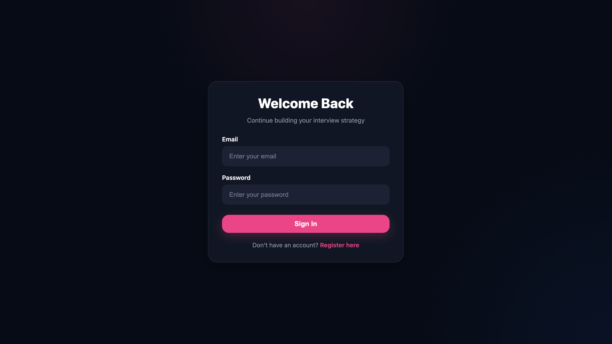
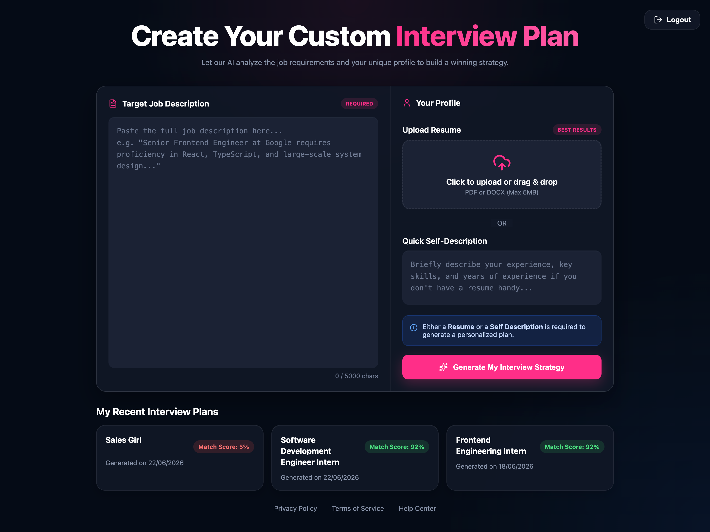
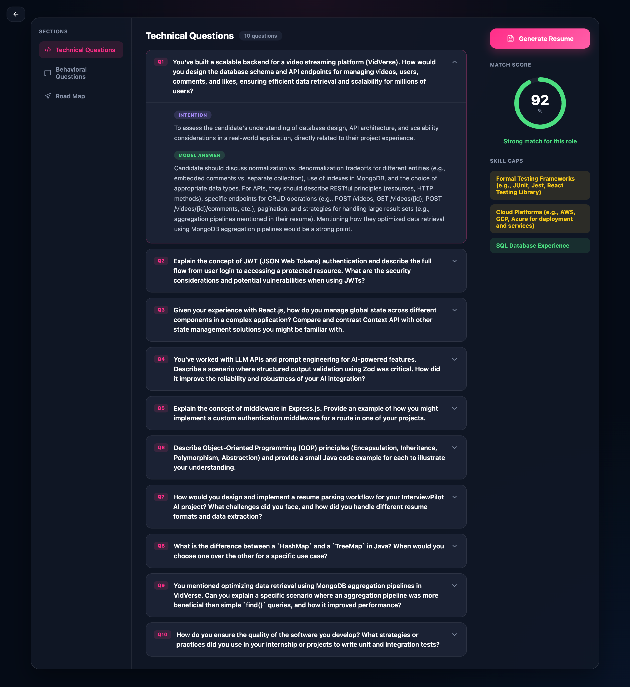
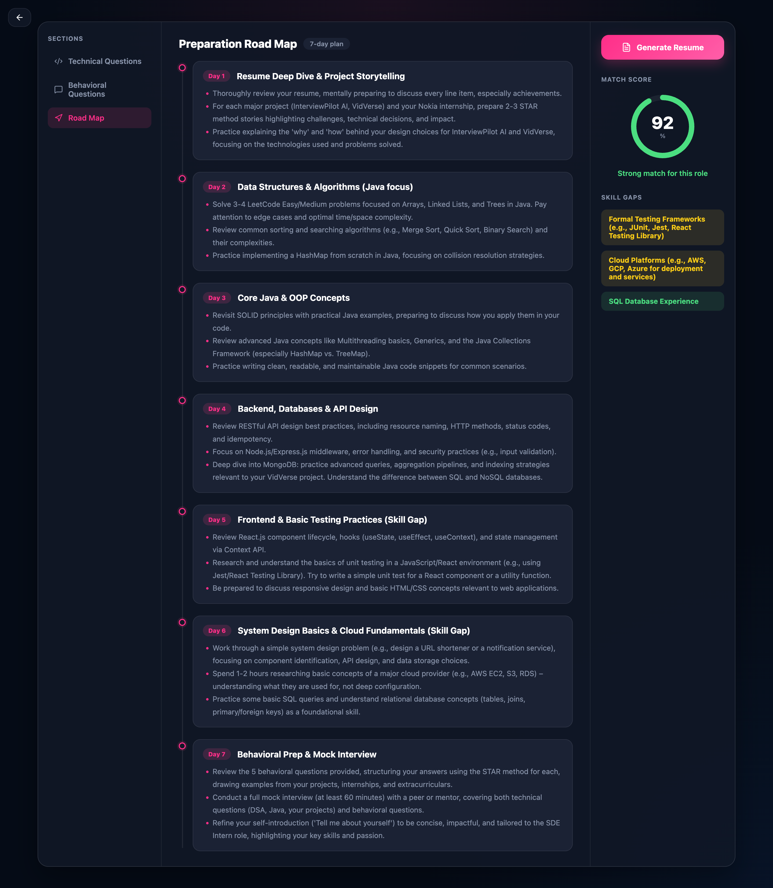

# InterviewPilot

InterviewPilot is a full-stack AI-powered interview preparation platform that helps users evaluate their job readiness by analyzing resumes, self-descriptions, and job descriptions. It generates personalized interview reports, identifies skill gaps, and creates ATS-friendly resumes tailored to the target role.

## 🌐 Live Demo

**Live Application:** https://interviewpilot-frontend.vercel.app

---

## ✨ Features

- 🤖 AI-generated interview reports
- 📊 Match score based on job description
- 💻 Technical interview questions with interviewer intent & expected answers
- 🗣️ Behavioral interview questions with interviewer intent & expected answers
- 📈 Skill gap analysis and personalized preparation roadmap
- 📄 AI-powered ATS-friendly resume generation (PDF)
- 📂 Resume upload or self-description support
- 🔐 Secure JWT Authentication
- 📝 Interview report history

---

## 🛠 Tech Stack

### Frontend
- React
- SCSS
- Axios
- React Router

### Backend
- Node.js
- Express.js
- MongoDB
- Mongoose

### AI & Authentication
- Gemini API
- Zod
- JWT Authentication

### Other Tools
- Puppeteer
- Multer
- PDF Parse

---

## 📷 Screenshots

### Login Page



### Home Page



### Generated Interview Report





---

## ⚙️ Installation

### Clone the repository

```bash
git clone https://github.com/arushiiiiii/InterviewPilot-AI.git
cd InterviewPilot-AI
```

### Backend

```bash
cd Backend
npm install
npm run dev
```

### Frontend

```bash
cd Frontend
npm install
npm run dev
```

---

## 🔑 Environment Variables

Create a `.env` file inside the Backend directory.

```env
PORT=
MONGODB_URI=
JWT_SECRET=
GEMINI_API_KEY=
FRONTEND_URL=
NODE_ENV=
```

---

## 📂 Project Structure

```
InterviewPilot-AI/
│
├── Frontend/
│   ├── src/
│   └── ...
│
├── Backend/
│   ├── src/
│   └── ...
│
└── README.md
```

---

## 🎯 Future Improvements

- Mock interview mode
- AI answer evaluation
- Voice interview support
- Interview analytics dashboard

---

## 👩‍💻 Author

**Arushi Gupta**

GitHub: https://github.com/arushiiiiii
